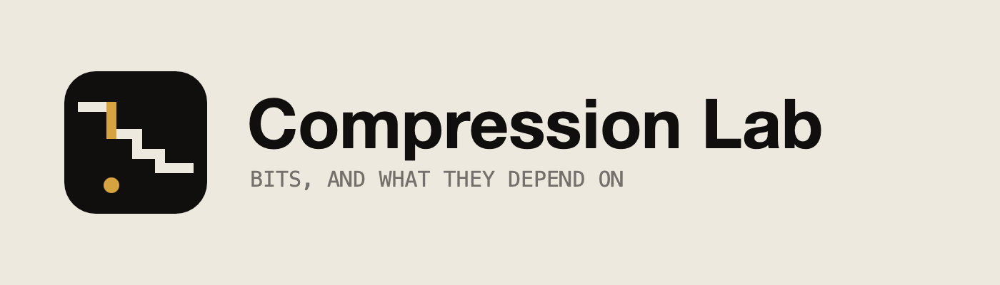

<div align="center">

<picture>
  <source media="(prefers-color-scheme: dark)" srcset="docs/brand/lockup-dark.png" />
  
</picture>

**What a text costs, and what that cost depends on.**

[**Open the app →**](https://andifathulms.github.io/compression-lab/)

[](https://github.com/andifathulms/compression-lab/actions/workflows/ci.yml)
[](https://github.com/andifathulms/compression-lab/actions/workflows/deploy.yml)


</div>

---

Entropy is not a property of a text. It is a property of a text under a model.
Condition on the previous character and it drops; condition on two and it drops
again. There is no single floor — there is a staircase, and every step down
costs something to describe. Total size is the code stream plus the model
description, and that total has a minimum at some order which depends on how
long the text is.

Paste a longer text and the minimum moves right. That is the whole argument.

## What is in it

| | |
|---|---|
| **The staircase** | H₀ through H₅, the three coders' measured rates, and the total including the model description. The minimum is marked. |
| **The text surface** | Every character tinted by its surprisal, `-log2 p`, under the current model. Predictable characters fade into the page. |
| **Huffman** | The merge sequence, the canonical code table, and the waste plot — where a whole number of bits overpays. |
| **Arithmetic** | The interval narrowing symbol by symbol, over the integer renormalization track that actually carries it. |
| **LZ77** | The window, the look-ahead, the match under the cursor, greedy against lazy matching. |
| **The parallel corpus** | One text in four languages, so the comparison is about the language and not about the content. |

Everything is written from scratch — the models, the entropies, the three
coders and their decoders, the bit I/O, the model serialiser and every chart.
There is no compression library here and no charting library.

## Running it

```sh
npm install
npm run dev        # http://localhost:5173
npm test           # engine round trips, bounds, model cost, timing
npm run typecheck
npm run lint
npm run build
```

Nothing is fetched at runtime. The sample texts are in the JavaScript bundle,
there is no analytics and no font CDN, and text pasted into the page never
leaves it. The network tab should be empty after load.

## Layout

```
src/
├─ engine/       pure: no React, no DOM, no randomness, no Date
│  ├─ bitio.ts       bit writer and reader
│  ├─ model.ts       order-0..5 models, static and adaptive, interned contexts
│  ├─ entropy.ts     conditional entropies and per-symbol surprisal
│  ├─ modelcost.ts   the model serialiser, and the measured model size
│  ├─ huffman.ts     build, canonical codes, encode, decode
│  ├─ arithmetic.ts  integer range coder and decoder
│  ├─ lz77.ts        hash-chain match finder, encode, decode
│  └─ trace.ts       what the views render
├─ views/        one directory per instrument
├─ state/        app state, URL serialisation, the analysis hook
├─ ui/           masthead, instrument rail, theme, the surprisal ramp
├─ styles/       tokens and base
└─ samples/      bundled texts, plain .txt, imported with ?raw
public/          the mark: favicon, installed icons, the manifest, the card
tests/
```

## What the numbers mean

**Model cost is measured, not estimated.** `serialiseModel` writes a real byte
format and `deserialiseModel` reads it back. `modelcost.test.ts` asserts that a
decoder given only the code stream and the model bytes reproduces the text, for
both Huffman and arithmetic, over the whole corpus at all six orders. If that
were a hand-wave, the minimum on the total curve would be fiction.

**Every coder has a working decoder**, tested, even though decompression is not
a user-facing feature. A coder without a decoder is unverified.

**Entropy and coder rates are different quantities and stay different.** The
entropy steps use unsmoothed counts, because that is what conditional entropy
means and because it is guaranteed non-increasing in the order. The coders pay
Laplace smoothing with alpha = 1 and, if static, the model description. The gap
between the two is the app's subject, so the app does not reconcile them.

**Three choices are arbitrary and change the numbers**, so each is stated in
the interface beside the figure it affects: the smoothing constant, the LZ77
token encoding, and the model serialisation format.

## The parallel corpus

`src/samples/udhr-*.txt` are the official translations of the Universal
Declaration of Human Rights, articles 1 to 30 and nothing else, so the four
files are strictly parallel. English, Indonesian and Finnish come from
Wikisource; German from the German Wikipedia article, which carries the
official joint German translation. One editor's addition to the Indonesian
article 30 was removed, since the sample is labelled as the official text.

The row exists to test one claim: that affix-heavy and agglutinative languages
carry more substring redundancy than character-level entropy reveals, so LZ77
should beat the order-0 prediction by a wider margin on the Indonesian text
than on the English one. Measured, at a 4,096-byte window:

| Language   |    H₀ |  LZ77 | H₀ − LZ77 |
|------------|------:|------:|----------:|
| English    |  4.35 |  3.72 |     0.636 |
| Indonesian |  4.17 |  3.32 | **0.851** |
| German     |  4.50 |  3.81 |     0.690 |
| Finnish    |  4.25 |  3.91 |     0.340 |

Indonesian bears the claim out — widest margin, lowest order-0 entropy.
Finnish does not, despite being the most agglutinative of the four. The
interface says both. Four texts of nine thousand characters do not settle it,
and the app does not pretend they do.

## Deviations from the specification, and why

<details>
<summary><b>Samples live in <code>src/samples/</code>, not <code>public/samples/</code></b></summary>

Files in `public/` are served, not bundled, so reading one would be a network
request at runtime, and an empty network tab is a hard requirement. They are
still plain `.txt`, imported with Vite's `?raw`. What `public/` does hold is
the mark — the favicon, the installed icons, the web manifest and the social
card — which the browser asks for whether or not the app does.
</details>

<details>
<summary><b>The arithmetic coder uses 48-bit registers, not 32</b></summary>

At 32 bits the floor division that carves the interval drifts upward by 1.54
bits on a 10,000-symbol order-4 text — inside the 2-bit bound, but with no
headroom left for a larger alphabet. Measured, then the register was widened
rather than the tolerance.
</details>

<details>
<summary><b>An adaptive model's description is not zero bits</b></summary>

Its counts are, because the decoder rebuilds them from the symbols it has
already decoded. Its alphabet and symbol count are really transmitted, so they
are in the figure. Measured, the order-3 adaptive description is about a
fiftieth of the static one, which makes the point without overstating it.
</details>

<details>
<summary><b><code>FrequencyModel</code> stores counts as interned integers</b></summary>

Not as a `Map<string, Map<string, number>>` walked afresh on each pass. The
documented shape is still exposed as `model.counts`, materialised on demand,
and the tests read it. The straightforward version measured 250 ms for a
10,000-character recompute against a 16 ms budget; see the commit for the four
changes that closed the gap.
</details>

<details>
<summary><b>The performance test asserts the ninetieth percentile, not the maximum</b></summary>

The occasional 25 ms sample is a garbage collection pause provoked by
rebuilding the analysis fifty times with no frames in between, which is not
what typing does. p50 is 12.5 ms, p90 is 14.4 ms on a developer machine.

On CI the budget is 32 ms rather than 16. A shared runner measured 17.0 ms for
the same commit that measures 14.4 ms locally — that is the runner, not the
code, and 16 ms is a claim about a reader's machine. On CI the test therefore
stops verifying the acceptance criterion, which cannot be verified there, and
becomes a regression guard. **Run `npm test` locally to check the criterion
itself**; the run prints p50, p90 and the maximum either way.
</details>

<details>
<summary><b>The faces are bundled</b></summary>

Literata for prose and JetBrains Mono for every figure, both as variable woff2
subsetted to Latin and Latin Extended, which is what the corpus needs —
English, German, Finnish, Indonesian. Five files, about 200 kB, in
`src/styles/fonts/`, declared in `src/styles/fonts.css`. Nothing is fetched
over the network; the fallback stack in `tokens.css` carries the first paint.

Iosevka was the original specification for the instrument voice and is not
used: it has no variable webfont worth vendoring at this subset size.
JetBrains Mono has the tabular figures and the open apertures the slot was for.
</details>

<details>
<summary><b>Two grounds</b></summary>

Paper and bench, chosen by the reader — the control is in the masthead, the
choice is stored locally and is deliberately not in the URL, and "system" keeps
following the operating system after load. The surprisal ramp is defined once
per ground: on paper it runs toward ink, on the bench toward a warm near-white.
See DESIGN.md §2.
</details>

## Deployment

GitHub Pages via Actions. `vite.config.ts` sets `base` to `/compression-lab/`;
change it if the repository is named something else, or set `VITE_BASE`. CI
runs typecheck, lint, test and build, and the deploy workflow runs the same
gate again so a deploy cannot outrun a failing suite.

## Reading further

[PRD.md](PRD.md) is what the app is for and why. [DESIGN.md](DESIGN.md) is how
it looks and why. [CLAUDE.md](CLAUDE.md) is the build brief.

---

<div align="center">

Designed & built by [Andi Fathul Mukminin](https://andifathulms.github.io/en/)
· [GitHub](https://github.com/andifathulms)
· [LinkedIn](https://www.linkedin.com/in/andifathulmukminin/)
· [Instagram](https://www.instagram.com/andifathulms/)

</div>
